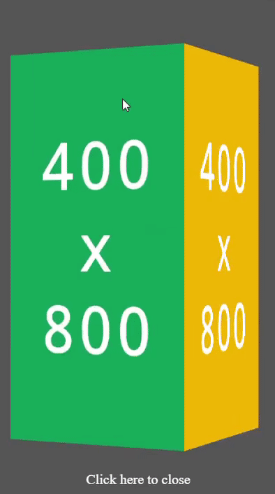

# ads-cube

Use a cube to display at most 4 ads. Pure JS and CSS with no dependency.



Live [demo](https://demching.github.io/ads-cube/example/adsCube.html)

## Usage

Include the JS and CSS files in `dist/`.

```html
<link rel="stylesheet" href="dist/adsCube.min.css">
<script src="dist/adsCube.min.js"></script>

<script>
    let adsCube = adsCube(opts)
</script>
```

This function will return a DOM Element that wraps the cube, `undefined` if something went wrong.

## Options

Customize your own showcase.

| Property | Type | Description |
| --- | --- | --- |
| `ads` | `Object[]` | Array of ads. Each ads object should contain property `src`. `src` could be the URL/base64 data uri of an image or it could be a DOM element. If `link` is set, the link will be opened in new tab. It will repeat ads if its length < 4 or exclude ads if length > 4. |
| `dir` | `number` | Rotate direction of the cube. `0` (default): left, `1`: right, `2`: down, `3`: up. |
| `popup` | `boolean` | Indicate if the cube is shown as a popup or a section in the document. Default: `false` |
| `responsive` | `boolean` | Indicate if the size of ads scales with the screen. Default: `false` |
| `fullscreen` | `boolean` | Indicate if the size of ads scales to full (100%) width/height of the screen. Only applicable if `responsive=true`. `false` (default): 80%, `true`: 100% |
| `autoClose` | `boolean` | Indicate if the popup close automatically. Only applicable if `popup=true`. Default: `false` |
| `autoRotate` | `boolean` | Indicate if the cube rotate automatically. Default: `true` |
| `popupWait` | `number` | Number of seconds before user can close the popup. Only applicable if `popup=true`. Default: `10` seconds |
| `width`/`height` | `number` | Width/Height of each ads. If `responsive=true`, its size will scale proportionally according to `width` and `height`. Else, fixed width/height is set. __Notice:__ If either `width` or `height` is missing, its size will be `80%` of the screen (`100%` if `responsive=true && fullscreen=true`). CSS may break if `width` and `height` are not set correctly. |
| `counter` | `number` | Style of showing time remains before closing the popup. Only applicable if `popup=true`. `0` (default): Countdown text, `1`: Radial countdown progress bar, `2`: Radial countdown progress bar with time, `3`: Rectangle countdown progress bar. |
| `container` | `DOMElement`/`string` | Append the cube to specific location. It could be CSS selector query string or a DOMElement. Only applicable if `popup=false`. |

Sample options:

```javascript
adsCube({
    width: 200,
    height: 400,
    ads: [
        { src: "/img/ad_1.png" },
        { src: "/img/ad_2.png" },
        { src: "/img/ad_3.png" },
        { src: "/img/ad_4.png" },
    ],
})
```

## Methods

### Rotation
If you want to control the rotate direction manually, you can use these methods:

```javascript
let cube = adsCube(opts);

// Only works if `dir=0/1`
cube.rotateLeft();
cube.rotateRight();

// Only works if `dir=2/3`
cube.rotateUp();
cube.rotateDown();
```

It is recommended to set `autoRotate` to `false` when using 

### Popup

If you want to close the popup manually, you can use this method:

```javascript
let cube = adsCube(opts);

// Only works for popup cube (after waiting is end)
cube.closePopup();
```

## Locale

You can set locale for some messages:

- `waitingMessage`: Message shown if setting `popupWait > 0`, `popup=true` and `counter=0`. Default: `"Please wait %s seconds to close..."` (`%s` will be replaced with the remaining time in seconds).
- `closeMessage`: Message shown when the popup can be closed. Default: `"Click here to close"`.

Simply specify the second parameter in the function will replace the message.

```javascript
let cube = adsCube(opts, locale);
```

## Support

If this repository helps you, you can give me some support.

<a href="https://www.buymeacoffee.com/demching" target="_blank"></a>
